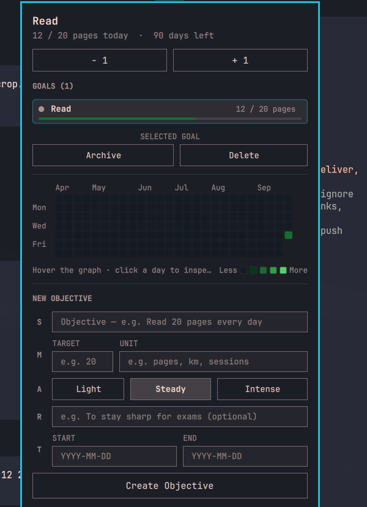
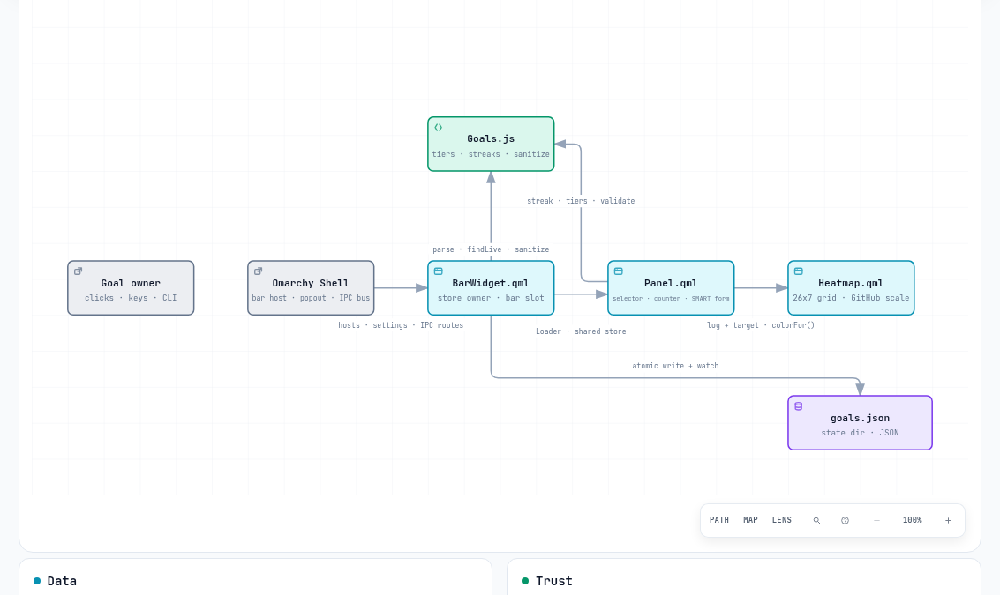

# goal-tracker

An Omarchy bar-widget plugin for defining **SMART objectives** and tracking daily progress on a GitHub-style contribution heatmap. No daemons, no databases, no network — five files, one JSON state file.



## Why

Habit trackers live in browser tabs you never open. This one lives in the top bar: the active goal and today's progress are always visible, logging is one middle-click, and the full history is one click away. It is built for people who set goals like engineers — *Specific, Measurable, Achievable, Relevant, Time-bound* — and want the creation form to enforce exactly that, nothing more.

Terminology, used consistently everywhere below: a **goal** is the stored object (what the bar shows); an **objective** is what the SMART creation form produces. Creating an objective stores a goal.

## Features

- **SMART creation form** — one rail row per dimension: **S**pecific objective, **M**easurable daily target + unit, **A**chievable pace (`Light`/`Steady`/`Intense`), **R**elevant why (optional), **T**ime-bound start/end dates.
- **GitHub-style heatmap** — 26 weeks × 7 days, Sunday-aligned, Primer contribution greens (dark `#151b23…#56d364`, classic light set on light themes), month + Mon/Wed/Fri labels, `Less…More` legend, hover inspection, click-to-inspect any day.
- **Daily counter + stepper** — `value / target` with `− 1` / `+ 1` halves, progress underline per goal, current streak (a run ending yesterday still counts as current).
- **Archive, don't lose** — finished goals move to a dimmed `ARCHIVED` section, still inspectable, restorable in one click; deletion is a two-click arm-and-confirm, never instant.
- **Fully keyboard-driven** — `+`/`-` log, `j`/`k`/`g`/`G` navigate, `Enter` select, `a` archive/restore, `d`/`x` arm delete, `Esc` backs out, `Tab` switches panels.
- **Scriptable over IPC** — `open close show hide toggle log unlog select archive unarchive remove add`, so keybinds and shell one-liners work (`omarchy-shell omasmartg.goal-tracker log 2`).
- **Zero dependencies** — pure QML + one `.pragma library` JS file. State is a single JSON file watched with `FileView`, so every monitor converges automatically.

## Architecture



Interactive version: [`docs/architecture.html`](docs/architecture.html) (spec: [`docs/architecture.json`](docs/architecture.json)).

One obvious main path: the user acts on shell surfaces → `BarWidget.qml` owns the store → `Panel.qml` presents it → `Heatmap.qml` draws it → `Goals.js` computes it → `goals.json` keeps it.

| File | Role |
|---|---|
| `manifest.json` | Plugin identity: `omasmartg.goal-tracker`, `kinds: ["bar-widget"]`, entry point `BarWidget.qml`. No settings schema, no services, no hooks. |
| `BarWidget.qml` | Store owner and bar slot. Loads/parses/persists `goals.json` via `FileView` (atomic writes, change watching, 300 ms save debounce), renders `name ✓/●`, routes IPC, hosts the panel through a `Loader`. |
| `Panel.qml` | Popup UI only — reads the store through `hostWidget`, never writes files directly. Goal selector, stepper, streak + pace line, heatmap instance, archive section, SMART form, keyboard map. |
| `Heatmap.qml` | Pure `Repeater` grid. No Canvas, no effects. Cell 10 px / 2 px gap / 2 px radius; level = `value / target` mapped to 0, <0.34, <0.67, <1.0, ≥1.0. |
| `Goals.js` | `.pragma library`: date keys (local-midnight, never UTC), `levelFor`, `streak`, `buildDays` (Sunday-aligned, future dates ignored), `sanitizeGoal` caps, `parseFile` (never throws), archive helpers. |
| `goals.json` | The only state: `{ activeId, goals[] }`, each goal `{ id, name, target, unit, startDate, endDate, log{date: value}, archived, archivedAt, effort, why }`. Lives at `~/.local/state/omarchy/goal-tracker/goals.json`. |

Extension points: new goal fields go through `sanitizeGoal` + the `touchGoal` copy (both must list them); new panel sections are plain `Column` children; new IPC methods are one function in the `IpcHandler` block (typed `string` args only — untyped `QVariant` params are rejected across IPC).

## Installation

From git (alias `install` works too):

```bash
omarchy plugin add https://github.com/<you>/omasmartg.goal-tracker.git --enable
```

Or manually — the repository root **is** the plugin, nothing to build:

```bash
cp -r omasmartg.goal-tracker ~/.config/omarchy/plugins/
omarchy plugin validate ~/.config/omarchy/plugins/omasmartg.goal-tracker
omarchy plugin enable omasmartg.goal-tracker
```

Then **restart the shell** (`omarchy restart shell`). The shell compiles and caches plugin QML: after any upgrade, validation passing is not enough — only a restart loads the new code. First run seeds one sample goal (`Read`, 20 pages); deleting every goal is respected and never re-seeded.

## Usage

- **Bar:** `Read ✓` means today's target is met, `●` means open. Left-click toggles the panel, middle-click logs +1.
- **Panel:** pick a goal to make it active; `− 1` / `+ 1` adjust today; finished goals show `· ended` — `Archive` them, `Restore` or `Delete` (two clicks) from the action bar or the `ARCHIVED` section.
- **CLI:** `omarchy-shell omasmartg.goal-tracker <method> [args]` — `log [n]`, `unlog [n]`, `select <id>`, `archive [id]`, `unarchive <id>`, `remove <id>`, `add <name> <target> <unit> <start> <end> <effort> <why>` (dates `YYYY-MM-DD`, empty = sensible defaults; returns `""` on success, an error message otherwise).

## Configuration

There is none. The manifest declares no settings and no defaults; behavior is data-driven. Back up or hand-edit `goals.json` while the shell runs — the watcher picks it up within a second (keep it valid JSON; corrupt files load as empty rather than crashing).

## Security

This plugin runs inside other people's shells from a git clone, so it is built to be boring:

- **Local-only.** No network requests, no telemetry, no external processes except `mkdir -p` of its own state directory with fixed arguments.
- **No markup rendering.** Every user-controlled string (names, units, "why") is displayed with `textFormat: Text.PlainText` — goal text cannot become executable markup.
- **No code execution paths.** No `eval`, no URL opening, no shelling out with user data. The only `Process` call takes no user input.
- **Paranoid parsing.** `goals.json` parses inside try/catch; every field is re-validated with hard caps (names ≤ 60 chars, units ≤ 24, why ≤ 140, log values ≤ 1 000 000, ≤ 64 goals). Unknown goal ids are no-ops in every mutation and IPC method.
- **Typed IPC.** All IPC arguments are typed `string`; untyped variants are rejected by the shell and were removed.
- **Inert install.** `omarchy plugin add` only clones files. There are no `bin/`, service entries, or install hooks — nothing executes until the widget is enabled.
- **Ordinary file permissions.** State inherits your umask; goals are not secrets, but don't store anything sensitive in them.
- Found something? Open an issue with the QML snippet and the shell log line (`journalctl --user | grep goal-tracker`).

## Limitations

- One active goal is shown in the bar; the rest live one click away.
- Goals have no in-place edit — change the target by delete + recreate, or archive + create (deliberate: keeps the log history honest).
- Delete has no undo; the two-click arm and archiving are the safety net.
- Concurrent edits from two monitors converge on last-persisted-wins (300 ms debounce); simultaneous edits to the *same* day from two screens can drop one write.
- Days are local-timezone calendar days; the heatmap is fixed at 26 weeks.
- After upgrading the plugin, restart the shell — see Installation.

## Roadmap

Ideas, not promises, roughly in value order: in-place goal editing; per-day adjustment by clicking heatmap cells; due-time reminders through Omarchy notifications; CSV import/export; non-daily (weekly) targets; optional second bar slot for another active goal.

## Contributing

- Keep the flat layout: the repo root is the plugin (`manifest.json` + sources at top level), exactly as `omarchy plugin add` expects it.
- Mirror changes in both places while developing: the repo is the source of truth, `~/.config/omarchy/plugins/omasmartg.goal-tracker/` is the live copy.
- Lint with the **Qt6** checker — `/usr/lib/qt6/bin/qmllint`, never `/usr/bin/qmllint` (Qt5, silently passes Qt6 parse errors). Zero `syntax`/`Expected` diagnostics.
- `omarchy plugin validate <dir>` must exit 0.
- No new runtime dependencies. New goal fields must be added to **both** `sanitizeGoal` and the `touchGoal` copy or archiving/logging will wipe them. New user text must use `textFormat: Text.PlainText`.
- Prove UI changes visually: `omarchy-shell omasmartg.goal-tracker open`, screenshot with `grim`, inspect at full resolution before claiming fixed.

## Development

```bash
omarchy plugin validate ./omasmartg.goal-tracker
/usr/lib/qt6/bin/qmllint BarWidget.qml Panel.qml Heatmap.qml   # syntax only; qs.* import warnings are expected standalone
node -e 'eval(require("fs").readFileSync("Goals.js","utf8").replace(/^\.pragma library\s*/,"")); console.log(levelFor(14,20), streak({"2026-09-30":20},20,"2026-09-30"))'
omarchy-shell omasmartg.goal-tracker log 2     # exercise the live store
```

Release checklist: Qt6 lint clean → `validate` exit 0 → sync to the live plugin dir → `omarchy restart shell` → no `goal-tracker.*(failed|error)` in `journalctl --user` → screenshot-verify the panel.

## License

MIT — see [LICENSE](LICENSE).
